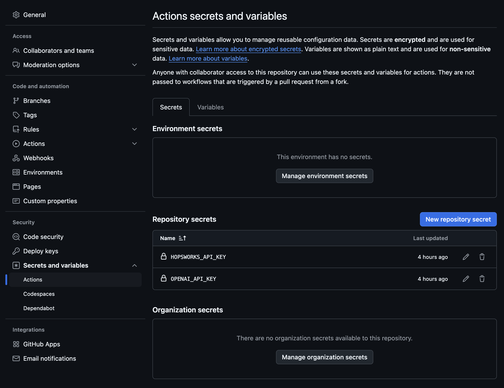
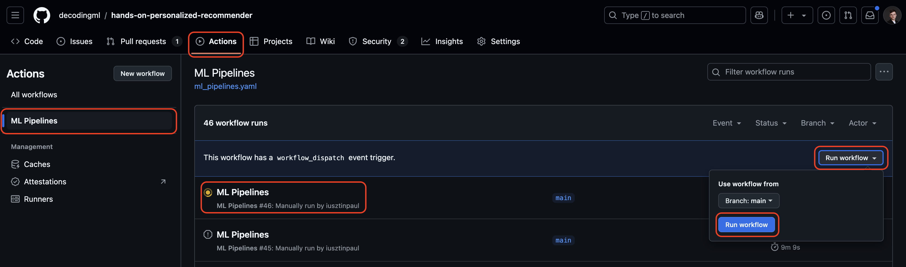
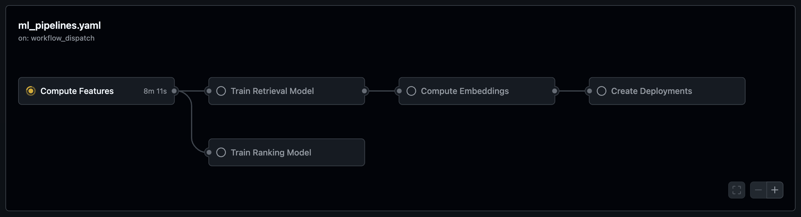
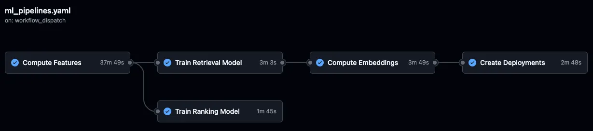

# 🚀 Installation and Usage Guide

This guide will help you set up and run a machine learning pipeline that includes feature engineering, model training, and deployment using Hopsworks and OpenAI.

# 📋 Prerequisites

## Local Tools
You'll need the following tools installed locally:
- [Python v3.11](https://www.python.org/downloads/)
- [uv v0.4.30](https://github.com/astral-sh/uv) - Python package installer and virtual environment manager
- [GNU Make 3.81](https://www.gnu.org/software/make/) - Build automation tool

## Cloud Services
The project requires access to these cloud services:

| Service | Purpose | Cost | Required Credentials | Setup Guide |
|---------|---------|------|---------------------|-------------|
| [Hopsworks](https://rebrand.ly/serverless-github) | AI Lakehouse for feature store, model registry, and serving | Free tier available | `HOPSWORKS_API_KEY` | [Create API Key](https://docs.hopsworks.ai/latest/user_guides/projects/api_key/create_api_key/) |
| [GitHub Actions](https://github.com/features/actions) | Compute & Automation | Free for public repos | - | - |
| [OpenAI API](https://openai.com/index/openai-api/) | LLM API for recommender system | Pay-per-use | `OPENAI_API_KEY`<br>`OPENAI_MODEL_ID` | [Quick Start Guide](https://platform.openai.com/docs/quickstart) |

# 🎯 Getting Started

## 1. Installation

Set up the project environment by running:
```bash
make install
```

This command will:
- Create a virtual environment using `uv`
- Activate the virtual environment
- Install all dependencies from `pyproject.toml`

## 2. Environment Configuration

Before running any components:
1. Create your environment file:
   ```bash
   cp .env.example .env
   ```
2. Open `.env` and configure the required credentials following the inline comments.

# ⚡️ Running the ML Pipelines

You can run the entire pipeline at once or execute individual components.

## Running the Complete Pipeline

Execute all components in sequence:
```bash
make all
```

This runs the following steps:
1. Feature engineering
2. Retrieval model training
3. Ranking model training
4. Candidate embeddings creation
5. Inference pipeline deployment
6. Materialization job scheduling

## Running Individual Components

Each component can be run separately:

1. **Feature Engineering**
   ```bash
   make feature-engineering
   ```
   View results in [Hopsworks Serverless](https://rebrand.ly/serverless-github): **Feature Store → Feature Groups**

2. **Retrieval Model Training**
   ```bash
   make train-retrieval
   ```
   View results in [Hopsworks Serverless](https://rebrand.ly/serverless-github): **Data Science → Model Registry**

3. **Ranking Model Training**
   ```bash
   make train-ranking
   ```
   View results in [Hopsworks Serverless](https://rebrand.ly/serverless-github): **Data Science → Model Registry**

4. **Embeddings Creation**
   ```bash
   make create-embeddings
   ```
   View results in [Hopsworks Serverless](https://rebrand.ly/serverless-github): **Feature Store → Feature Groups**

5. **Deployment Creation**
   ```bash
   make create-deployments
   ```
   View results in [Hopsworks Serverless](https://rebrand.ly/serverless-github): **Data Science → Deployments**

6. **Materialization Job Scheduling**
   ```bash
   make schedule-materialization-jobs
   ```
   View results in [Hopsworks Serverless](https://rebrand.ly/serverless-github): **Compute → Ingestions**

## 🚨 Important Notes
- All notebooks are executed using IPython through the UV virtual environment
- Components should be run in the specified order when executing individually
- Ensure UV is properly installed and configured before running any commands

# 🛠️ Additional Operations

## Launch Frontend Application
Start the Streamlit UI that interfaces with [Hopsworks](https://rebrand.ly/serverless-github):
```bash
make start-ui
```

## Clean Up Resources
Remove all created resources from [Hopsworks Serverless](https://rebrand.ly/serverless-github):
```bash
make clean-hopsworks-resources
```

# 🤖 Running the ML Pipelines in GitHub Actions

This project supports running ML pipelines automatically through GitHub Actions, providing an alternative to local or Colab execution.

> [!NOTE]
> This is handy when getting network errors, such as timeouts, on your local machine. GitHub Actions has an enterprise-level network that will run your ML pipelines smoothly.

## Pipeline Triggers

The ML pipelines can be triggered in three ways:
- Manual trigger through GitHub UI
- Scheduled execution (configurable)
- On push to main branch (configurable)

## Setup Process

### 1. Fork Repository
Create your own copy of the repository to access GitHub Actions:
```bash
# Use GitHub's UI to fork the repository
https://github.com/original-repo/name → Your-Username/name
```
[📚 GitHub Fork Guide](https://docs.github.com/en/pull-requests/collaborating-with-pull-requests/working-with-forks/fork-a-repo)

### 2. Configure Secrets
Set up required environment variables as GitHub Actions secrets:

**Option A: Using GitHub UI**
1. Navigate to: Repository → Settings → Secrets and variables → Actions
2. Click "New repository secret"
3. Add required secrets:
   - `HOPSWORKS_API_KEY`
   - `OPENAI_API_KEY`

[📚 Set up GitHub Actions Secrets Guide](https://docs.github.com/en/actions/security-for-github-actions/security-guides/using-secrets-in-github-actions?tool=webui)

<p align="center">
  <a href="https://decodingml.substack.com/p/33d3273e-b8e3-4d98-b160-c3d239343022">
    
  </a>
</p>

**Option B: Using GitHub CLI**

If you have `GitHub CLI` installed, instead of settings the GitHub Actions secrets manually, you can set them by running the following:

```bash
gh secret set HOPSWORKS_API_KEY
gh secret set OPENAI_API_KEY
```

### 3. Execute Pipeline

#### Manual Execution
1. Go to Actions → ML Pipelines
2. Click "Run workflow"
3. Select branch (default: main)
4. Click "Run workflow"

<p align="center">
  <a href="https://decodingml.substack.com/p/33d3273e-b8e3-4d98-b160-c3d239343022">
    
  </a>
</p>

After triggering the pipeline, you will see it running, signaled by a yellow circle. Click on it to see the progress.

<p align="center">
  <a href="https://decodingml.substack.com/p/33d3273e-b8e3-4d98-b160-c3d239343022">
    
  </a>
</p>

After it is finished, it should look like this:

<p align="center">
  <a href="https://decodingml.substack.com/p/33d3273e-b8e3-4d98-b160-c3d239343022">
    
  </a>
</p>

#### Automated Execution

Another option is to run the ML pipelines automatically on a schedule or when new commits are pushed to the main branch.

Edit `.github/workflows/ml_pipelines.yaml` to enable automatic triggers:

```yaml
name: ML Pipelines

on:
  # schedule: # Uncomment to run the pipelines every 2 hours. All the pipelines take ~1.5 hours to run.
  #   - cron: '0 */2 * * *'
  # push: # Uncomment to run pipelines on every new commit to main
  #   branches:
  #     - main
  workflow_dispatch:  # Allows manual triggering from GitHub UI
```

## Monitoring & Results

1. **Pipeline Progress**
   - View real-time execution in Actions tab
   - Each step shows detailed logs and status

2. **Output Verification**
   - Access results in [Hopsworks Serverless](https://rebrand.ly/serverless-github)
   - Check Feature Groups, Feature Views, Model Registry, and Deployments

## ⚠️ Important Notes
- Full pipeline execution takes approximately 1.5 hours
- Ensure sufficient GitHub Actions minutes available
- Monitor usage when enabling automated triggers
