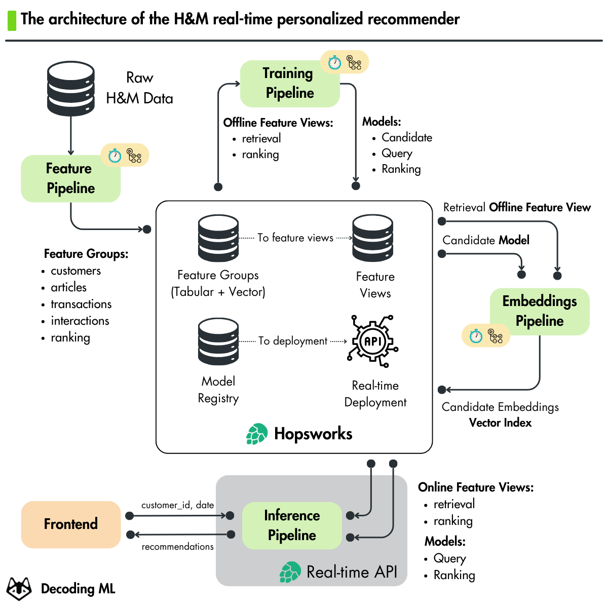
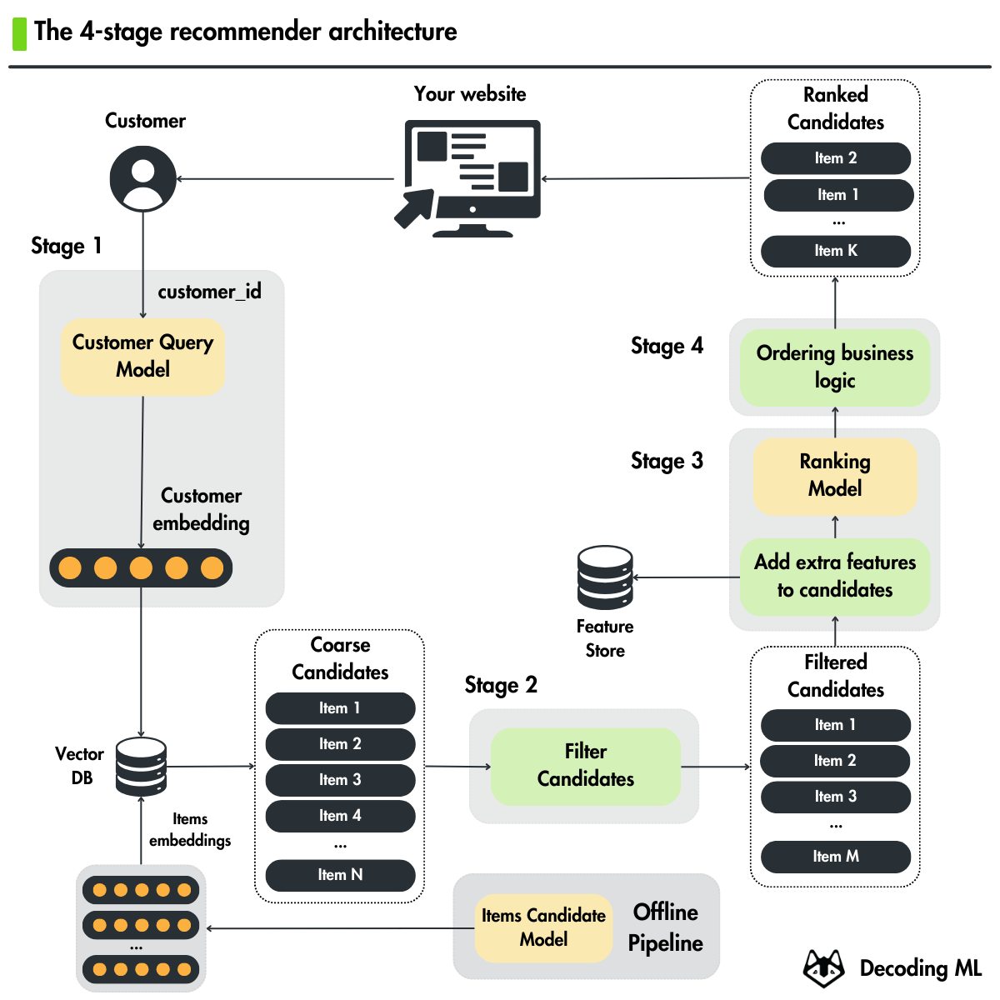
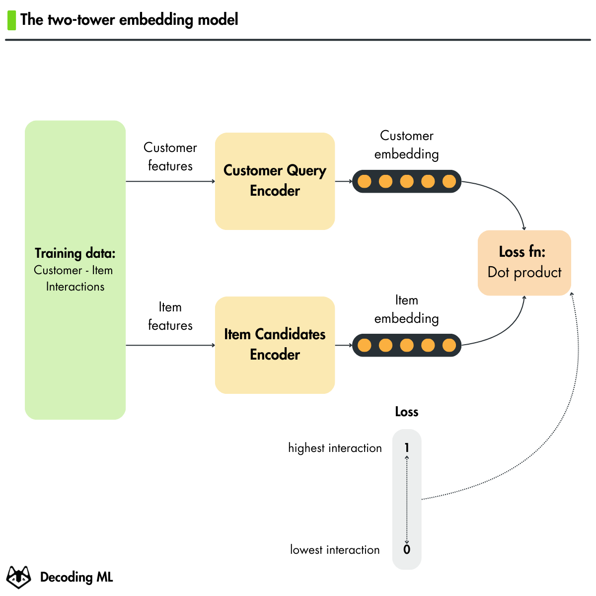
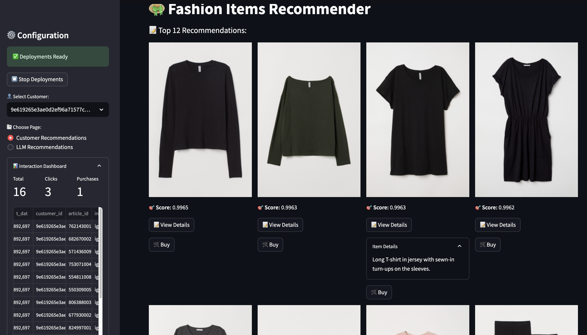

<div align="center">
  <h1>Hands-on H&M Real-Time Personalized Recommender</h1>
  <p class="tagline">Open-source course by <a href="https://decodingml.substack.com">Decoding ML</a> in collaboration with <a href="https://rebrand.ly/homepage-github">Hopsworks</a>.</p>
</div>

</br>

<p align="center">
  <a href="https://decodingml.substack.com/p/33d3273e-b8e3-4d98-b160-c3d239343022">
    
  </a>
</p>

## 🎯 About This Course

This hands-on course teaches you how to build and deploy a real-time personalized recommender system for H&M fashion articles. You'll learn:

- A practical 4-stage recommender architecture
- Two-tower model implementation and training
- Scalable ML system design principles
- MLOps best practices
- Real-time model deployment
- LLM-enhanced recommendations
- Building an interactive web interface

<p align="center">
  
  
</p>


## 👥 Target Audience

**This course is ideal for:**
- ML/AI engineers interested in building production-ready recommender systems
- Data Engineers, Data Scientists, and Software Engineers wanting to understand the engineering behind recommenders

**Note:** This course focuses on engineering practices and end-to-end system implementation rather than theoretical model optimization or research.

## 🎓 Prerequisites

| Category | Requirements |
|----------|-------------|
| **Skills** | Basic knowledge of Python and Machine Learning |
| **Hardware** | Any modern laptop/workstation will do the job (no GPU or powerful computing power required). |
| **Level** | Intermediate |


## 💰 Cost Structure

All tools used throughout the course will stick to their free tier, except OpenAI's API, as follows:

- Lessons 1-4: Completely free
- Lesson 5 (Optional): ~$1-2 for OpenAI API usage when building LLM-enhanced recommenders

## 📚 Course

This **self-paced course** consists of **5 comprehensive modules** covering theory, system design, and hands-on implementation.

Our recommendation for each module:
1. Read the article
2. Run the Notebook (locally or on Colab)
3. Go deeper into the code

| Module | Article | Description | Local Notebooks | Colab Notebooks |
|--------|-------|-------------|----------------|-----------------|
| 1 | [Building a TikTok-like recommender](https://decodingml.substack.com/p/33d3273e-b8e3-4d98-b160-c3d239343022) | Learn how to architect a recommender system using the 4-stage architecture and two-tower model. | **No code** | **No code** |
| 2 | The feature pipeline | Learn how to build a scalable feature pipeline (WIP) | •[1_fp_computing_features.ipynb](notebooks/1_fp_computing_features.ipynb) | - |
| 3 | The training pipelines | Learn how to train and evaluate recommendation models (WIP) | •[2_tp_training_retrieval_model.ipynb](notebooks/2_tp_training_retrieval_model.ipynb)<br>•[3_tp_training_ranking_model.ipynb](notebooks/3_tp_training_ranking_model.ipynb) | - |
| 4 | The inference pipelines | Learn how to deploy models for real-time inference (WIP) | •[4_ip_computing_item_embeddings.ipynb](notebooks/4_ip_computing_item_embeddings.ipynb)<br>•[5_ip_creating_deployments.ipynb](notebooks/5_ip_creating_deployments.ipynb)<br>•[6_scheduling_materialization_jobs.ipynb](notebooks/6_scheduling_materialization_jobs.ipynb) | - |
| 5 | Building personalized real-time recommenders with LLMs | Learn how to enhance recommendations with LLMs (WIP) | - | - |

> [!NOTE]
> Check the [INSTALL_AND_USAGE](https://github.com/decodingml/hands-on-personalized-recommender/blob/main/INSTALL_AND_USAGE.md) doc for a step-by-step installation and usage guide.


## 🏗️ Project Structure

At Decoding ML we teach how to build production ML systems, thus the course follows the structure of a real-world Python project:

```bash
.
├── notebooks/          # Jupyter notebooks for each pipeline
├── recsys/             # Core recommender system package
│   ├── config.py       # Configuration and settings
│   ...
│   └── training/       # Training pipelines code
├── tools/              # Utility scripts
├── tests/              # Unit and integration tests
├── .env.example        # Example environment variables template
├── Makefile            # Commands to install and run the project
├── pyproject.toml      # Project dependencies
```

## 🚀 Getting Started

For detailed installation and usage instructions, see our [INSTALL_AND_USAGE](https://github.com/decodingml/hands-on-personalized-recommender/blob/main/INSTALL_AND_USAGE.md) guide.

**Recommendation:** While you can follow the installation guide directly, we strongly recommend reading the accompanying articles to gain a complete understanding of the recommender system.

<p align="center">
  <a href="https://decodingml.substack.com/p/33d3273e-b8e3-4d98-b160-c3d239343022">
    
  </a>
</p>

## 💡 Questions and Troubleshooting

Have questions or running into issues? We're here to help!

Open a [GitHub issue](https://github.com/decodingml/hands-on-personalized-recommender/issues) for:
- Questions about the course material
- Technical troubleshooting
- Clarification on concepts

When having issues with [Hopsworks Serverless](https://rebrand.ly/serverless-github), the best place to ask questions is on [Hopsworks's Slack](https://join.slack.com/t/public-hopsworks/shared_invite/zt-1uf21vitz-rhHKNdIf8GEiOf1EJ6Wzsw), where their engineers can help you directly.

## Sponsors

<table>
  <tr>
    <td align="center">
      <a href="https://rebrand.ly/homepage-github" target="_blank">Hopsworks</a>
    </td>
  </tr>
  <tr>
    <td align="center">
      <a href="https://rebrand.ly/homepage-github" target="_blank">
        
      </a>
    </td>
  </tr>
</table>

## Contributors


<table>
  <tr>
    <td align="center">
      <a href="https://github.com/iusztinpaul">
        <br />
        <sub><b>Paul Iusztin</b></sub>
      </a><br />
      <sub>AI/ML Engineer</sub>
    </td>
    <td align="center">
      <a href="https://github.com/915-Muscalagiu-AncaIoana">
        <br />
        <sub><b>Anca Ioana Muscalagiu</b></sub>
      </a><br />
      <sub>AI/ML Engineer</sub>
    </td>
     <td align="center">
      <a href="https://github.com/paoloap-py">
        <br />
        <sub><b>Paolo Perrone</b></sub>
      </a><br />
      <sub>AI/ML Engineer</sub>
    </td>
    <td align="center">
      <a href="https://github.com/logicalclocks">
        <br />
        <sub><b>Hopsworks's Engineering Team</b></sub>
      </a><br />
      <sub>AI Lakehouse</sub>
    </td>
  </tr>
</table>


## License

This course is an open-source project released under the Apache-2.0 license. Thus, as long you distribute our LICENSE and acknowledge your project is based on our work, you can safely clone or fork this project and use it as a source of inspiration for your educational projects (e.g., university, college degree, personal projects, etc.).
